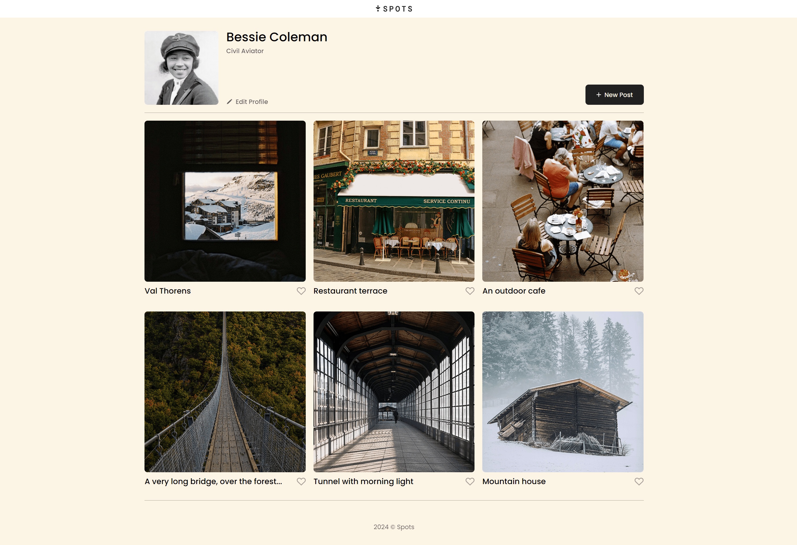
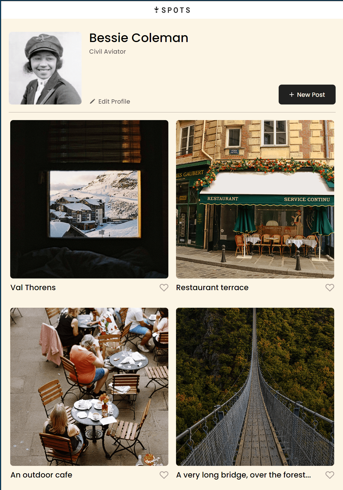
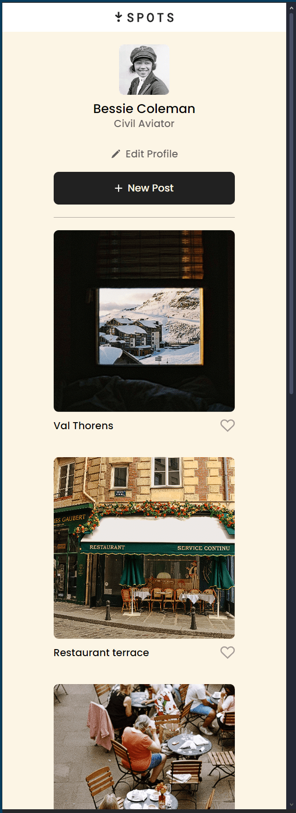

# Daniel 's Project 3: Spots

### Overview

- Intro
- Figma
- Images

**Intro**

This project was made to display or put to practice the use of media queries to help create a more responsive webpage across different screen sizes. In the cards.css, you will see the implementation of the grid layout. Throughout the remaining styles the use of flexbox is present to accommodate some of the many elements within the project. When using the DevTool, you can change the viewport according to the popular screen sizes to see the media queries come to life.

**Figma**

- [Link to the project on Figma](https://www.figma.com/file/BBNm2bC3lj8QQMHlnqRsga/Sprint-3-Project-%E2%80%94-Spots?type=design&node-id=2%3A60&mode=design&t=afgNFybdorZO6cQo-1)

**Images**

